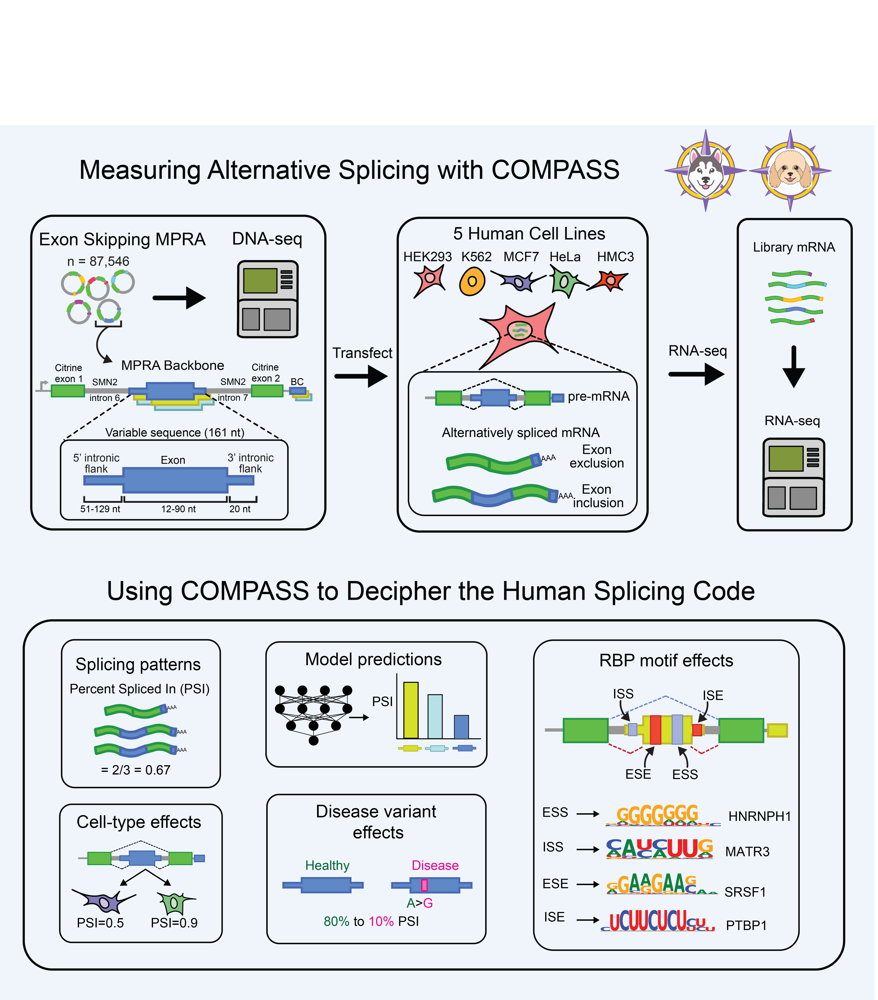

# Splicing MPRA Analysis

This repository contains all scripts and resources used for the analysis of the splicing MPRA described in:  

**Massively parallel assay of human splice variants reveals cis-regulatory drivers of disease-associated and cell type-specific splicing regulation**  
Samantha E. Koplik*, Angela M Yu*, Madelyn R. Shelby, Gabriel C. Fonseca, Charles M. Roco, Yue Zhang, Nicholas Bogard, Alex K. Sabo, Alexander B. Rosenberg, Johannes Linder, Georg Seelig  
\*These authors contributed equally to this work  

Raw and processed data are available on GEO under accession 
[**GSE307247**](https://www.ncbi.nlm.nih.gov/geo/query/acc.cgi?acc=GSE307247).

The bioinformatic pipeline is demonstrated with **MCF7 Rep2**, but the same workflow applies to all cell lines and replicates.  
Update file paths in the scripts (`GitHub_path`, `supertable_file`, `gtf_file`, `data_dir`, etc.) to match your environment.

The most up-to-date supertable file with sequence annotations is:  
`Data_Pre-Processing/st_final_with_snp_and_coords_05_30_25.csv.gz`  

An older version (same sequence content but fewer metadata annotations) is also provided:  
`Data_Pre-Processing/supertable.tsv.gz`  

--- 

## Repository Structure

- **Data_Pre-Processing/**  
  Contains all code for preparing and processing raw sequencing data. Subfolders include:
  - **STAR_alignment_scripts/**  
    Example alignment scripts (demonstrated with MCF7 Rep2). Replace prefixes to run other cell lines and replicates.
  - **Splicing_Profiles/**  
    Scripts to extract exon inclusion and splicing profiles from STAR outputs.
  - **Post-processing/**  
    Scripts to merge STAR outputs and generate PSI, ΔPSI, and logit values across all cell lines.  
    Example: `run_merge_psi_clipping_no_psuedo.sh`

  ### Bioinformatic Pipeline Order

  1. **DNA Clustering (Optional)**  
     Cluster DNA barcodes and generate the reference FASTA and GTF/GFF annotation files.  
     - The reference FASTA is already provided on GEO, so this step can be skipped if you want to use the pre-generated files.

  2. **RNA-seq Filtering**  
     Filter RNA-seq reads by DNA barcode clusters to remove mismatched or low-quality barcodes.  
     - This prepares the input FASTQ files for alignment.  

  3. **STAR Alignment**  
     Map filtered RNA-seq reads to the reference sequences using STAR.  
     Example: `bash STAR_alignment_example_MCF7_Rep2.sh`  
     - Replace the prefixes to process other cell lines.

  4. **Splicing Profiles**  
     Extract exon inclusion and splicing profiles from the STAR alignment outputs.  
     Example: `bash run_get_STAR_separate_splicing_profiles_MCF7_Rep2_20231031.sh`

  5. **Post-processing of PSIs**  
     Merge and post-process STAR outputs to generate PSI, ΔPSI, and logit values across all cell lines.  
     Example:  
     ```bash
     bash /ESL/ESL_MPRA/Data_Pre-Processing/Post-process_STAR_PSIs/run_merge_psi_clipping_no_psuedo.sh
     ```

- **Figure1/** through **Figure5/**  
  Code to reproduce all analyses and plots from the main figures in the paper.

- **SI_figures/**  
  Code to reproduce all analyses and plots from the Supplementary Information.
